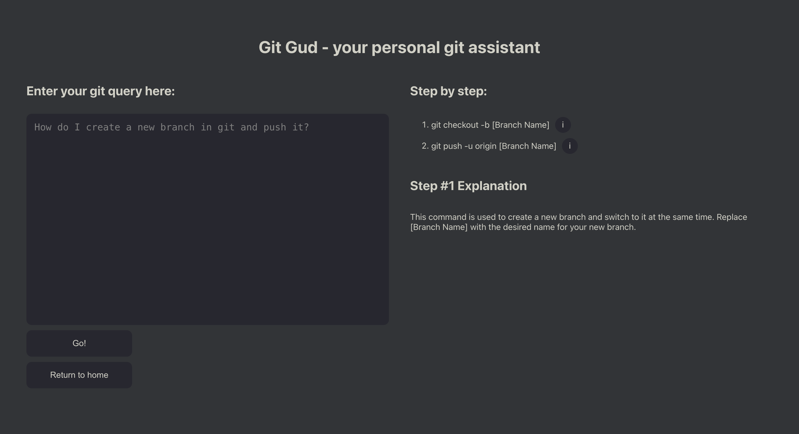

# 🚀 Git Gud - Your Personal Git Assistant

**Git Gud** leverages AI to provide developers with the appropriate Git command line instructions based on their stated goals. Simplifying version control has never been easier!

## 🧐 About the Project
'Git Gud' is built to streamline the workflow for software developers. It not only interprets user queries about Git operations but also provides step-by-step command line instructions and explanations.

## ✨ Features
- AI-powered Git command generation
- Easy to understand step-by-step instructions
- Interactive web interface with real-time feedback

## 🏁 Getting Started
To get a local copy up and running follow these simple steps.

### Prerequisites
- npm
bash
npm install npm@latest -g

### Installation
1. Clone the repo
bash
git clone https://github.com/AlexLee09/GitGud.git

2. Install NPM packages for the frontend
bash
cd GitGud/frontend
npm install

3. Start the frontend application
bash
npm start

4. In a separate terminal, install NPM packages for the backend
bash
cd ../backend
npm install

5. Start the backend server
npx nodemon

## 🖥️ Usage
After starting both the frontend and the backend, you can interact with the application through your web browser by visiting the local address provided by the React app, `http://localhost:3000`.

## 🧰 Tech Stack
- [Node.js](https://nodejs.org/)
- [Express.js](https://expressjs.com/)
- [React.js](https://reactjs.org/)
- [OpenAI API](https://openai.com/api/)
- [Framer Motion](https://www.framer.com/motion/)